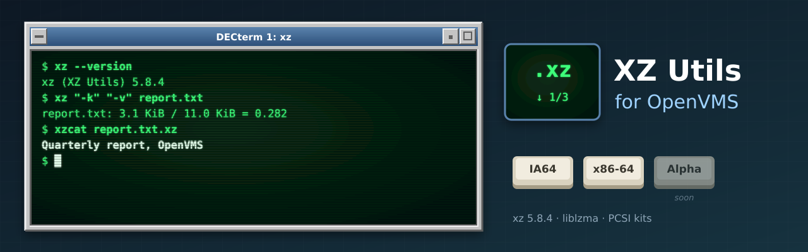

<p align="center">
  
</p>

# XZ Utils for OpenVMS

[XZ Utils](https://tukaani.org/xz/) (**5.8.4**), the xz compressor and the liblzma library, built
natively for OpenVMS on **IA64** and **x86-64**, following its own releases. It belongs to the same
family as [GNU grep](https://github.com/issinoho/vms-grep),
[GNU sed](https://github.com/issinoho/vms-sed), [GNU awk](https://github.com/issinoho/vms-awk),
[GNU make](https://github.com/issinoho/vms-make),
[GNU diffutils](https://github.com/issinoho/vms-diffutils),
[GNU patch](https://github.com/issinoho/vms-patch), [GNU m4](https://github.com/issinoho/vms-m4),
[GNU Bison](https://github.com/issinoho/vms-bison), [flex](https://github.com/issinoho/vms-flex),
[GNU Wget](https://github.com/issinoho/vms-wget), [curl](https://github.com/issinoho/vms-curl),
[PCRE2](https://github.com/issinoho/vms-pcre2), [zlib](https://github.com/issinoho/vms-zlib),
[bzip2](https://github.com/issinoho/vms-bzip2) and [Zstandard](https://github.com/issinoho/vms-zstd)
for OpenVMS.

This repository holds **only our changes**: every build starts from the signed release tarball
(Lasse Collin's key, pinned in `keys/`), applies our patches and adds our VMS files. As for grep,
sed and diffutils, xz's own `configure` runs on a Linux host with every compile and link test sent
to VSI C on the node, and MMS builds the result.

## Status

| | IA64 (OpenVMS V8.4-2L3, VSI C 7.4) | x86-64 (OpenVMS E9.2-4, VSI C 7.7) |
|---|---|---|
| VSI C configure answers (identical on both) | yes | yes |
| Builds | yes | yes |
| Smoke test: upstream's test files (all 33 `good-*` files test clean, all 59 `bad-*` files are errors), text and binary round trips, `xz -l`, `xzdec`, `lzmainfo`, a `/NAMES=UPPERCASE` program linking with `LIBLZMA.OLB`, a missing file | 10/10 | 10/10 |
| Kit install, smoke test on the installed kit, remove | pending | pending |
| PCSI kit (`XZ`, `V5.8-4E1`) | `ISSINOHO-I64VMS-XZ-V0508-4E1-1.PCSI` | `ISSINOHO-X86VMS-XZ-V0508-4E1-1.PCSI` |

## Installing the kit

Download the kit for your architecture from the
[latest release](https://github.com/issinoho/vms-xz/releases/latest) and check it against the
release's `SHA256SUMS`. A kit downloaded through a non-VMS system loses its record format, so
restore that first, then install it:

```
$ SET FILE/ATTRIBUTE=(RFM:FIX,LRL:8192,MRS:8192,RAT:NONE) ISSINOHO-*-XZ-V0508-4E1-1.PCSI
$ PRODUCT INSTALL XZ /PRODUCER=ISSINOHO /SOURCE=dev:[dir]
$ @XZ$ROOT:[000000]XZ$SETUP.COM
$ xz "-k" file.txt
```

It installs `xz`, `xzdec` and `lzmainfo` in `[XZ.BIN]`, `LIBLZMA.OLB` (liblzma) in `[XZ.LIB]`,
`LZMA.H` and `LZMA_*.H` in `[XZ.INCLUDE]`, `XZ$SETUP.COM`, the documentation and `README.VMS` in
`[XZ.DOC]`, and `SYS$STARTUP:XZ$STARTUP.COM`, which defines `XZ$ROOT` (add it to
`SYS$MANAGER:SYSTARTUP_VMS.COM`). `PRODUCT REMOVE XZ` removes it.

## On VMS

- **Commands:** `XZ$SETUP.COM` defines `xz`, `unxz` (`xz -d`), `xzcat` (`xz -dc`), `xzdec`
  and `lzmainfo`.
- **Text files:** a VMS text file (variable-length or VFC records) is compressed as text:
  its records become LF-terminated lines, as on Unix, and decompressing gives a Stream_LF
  file with the same lines. Any other file (stream, fixed-length records: executables, kits)
  is compressed byte for byte.
- **The library:** compile with `/INCLUDE=XZ$ROOT:[INCLUDE]` and link with
  `XZ$ROOT:[LIB]LIBLZMA.OLB/LIBRARY`. It is compiled `/NAMES=(AS_IS,SHORTENED)` and its
  headers declare the API so, so programs compiled with any `/NAMES` link with it.
- **File names** such as `file.txt.xz` need an ODS-5 disk.
- **Exit status:** a failed run has error severity under DCL, so `ON ERROR` works; under a
  GNV shell, `$?` is the exit code as on Unix.
- **Upper-case options in batch jobs:** under the TRADITIONAL DCL parse style unquoted
  options reach the program in lower case; quote them, use the long forms, or
  `$ SET PROCESS/PARSE_STYLE=EXTENDED` first.
- **Memory:** single-threaded; `-9` needs about 674 MiB to compress, more than a default
  `PGFLQUOTA` allows ("not enough core"); the default `-6` needs about 94 MiB.
- **configure on VMS:** three `config.h` defines come from tests without a cache variable
  (GNU C builtins and the constructor attribute), where the host's gcc answered;
  `prepare.sh` turns them off (`config-h-undef.txt`) and checks `config.h` against the VSI C
  configure run's.

## Patches

| Patch | Purpose |
|---|---|
| 0001 | `src/xz/file_io.c`: `st_ino` is an array only without `_USE_STD_STAT` (upstream's VMS code assumed the old layout). |
| 0002 | `src/common/sysdefs.h`: `exit()` through `vms_exit()` (error severity for 1, warning for 2). |
| 0003 | `src/xz/file_io.c`, `src/common/tuklib_progname.c`: no directory `fsync()` on VMS (`open()` of a directory fails, so every decompression failed); the program name `xz`. |
| 0004 | `src/liblzma/api/lzma.h`: the API under `#pragma names as_is, shortened`; subheaders included as `lzma_*.h` (VSI C does not find `"lzma/version.h"` relative to a VMS include directory). |

## How to build

Set up `tools/nodes.conf` as described in
[vms-grep's README](https://github.com/issinoho/vms-grep#2b-build-on-vms-from-the-host-over-ssh).
The smoke tests compare files with VSI Perl.

```sh
git clone https://github.com/issinoho/vms-xz.git
cd vms-xz
tools/vms_configure.sh ia64 # VSI C configure run (once per release)
tools/prepare.sh            # fetch + verify, patch, MMS lists, kit inputs
tools/build.sh ia64         # upload, then @[.VMS]BUILD on the node (MMS)
tools/test.sh ia64          # smoke test
tools/kit.sh ia64           # PCSI kit -> out/kits/
```

## Roadmap

1. Link this library into the other ports where they can use it (Wget, curl).
2. Offer the patches upstream.
3. A port to OpenVMS **Alpha**.

The family of ports, all for IA64 and x86-64, each following its upstream releases:

| Port | Latest release | |
|---|---|---|
| GNU grep — [vms-grep](https://github.com/issinoho/vms-grep) | [v3.12-vms3](https://github.com/issinoho/vms-grep/releases/tag/v3.12-vms3) | with `grep -P` through PCRE2 |
| PCRE2 — [vms-pcre2](https://github.com/issinoho/vms-pcre2) | [v10.49-vms1](https://github.com/issinoho/vms-pcre2/releases/tag/v10.49-vms1) | the regular-expression library |
| GNU sed — [vms-sed](https://github.com/issinoho/vms-sed) | [v4.10-vms1](https://github.com/issinoho/vms-sed/releases/tag/v4.10-vms1) | the stream editor |
| GNU awk (gawk) — [vms-awk](https://github.com/issinoho/vms-awk) | [v5.4.1-vms1](https://github.com/issinoho/vms-awk/releases/tag/v5.4.1-vms1) | built with gawk's own VMS port |
| zlib — [vms-zlib](https://github.com/issinoho/vms-zlib) | [v1.3.2-vms1](https://github.com/issinoho/vms-zlib/releases/tag/v1.3.2-vms1) | the compression library |
| bzip2 — [vms-bzip2](https://github.com/issinoho/vms-bzip2) | not yet released | the bzip2 compressor and libbz2 |
| **XZ Utils** (this port) — [vms-xz](https://github.com/issinoho/vms-xz) | not yet released | xz and liblzma |
| Zstandard — [vms-zstd](https://github.com/issinoho/vms-zstd) | not yet released | zstd and libzstd |
| curl — [vms-curl](https://github.com/issinoho/vms-curl) | [v8.22.0-vms1](https://github.com/issinoho/vms-curl/releases/tag/v8.22.0-vms1) | alongside VSI's curl kit, following curl's own releases |
| GNU Wget — [vms-wget](https://github.com/issinoho/vms-wget) | [v1.25.0-vms2](https://github.com/issinoho/vms-wget/releases/tag/v1.25.0-vms2) | the web retriever |
| GNU m4 — [vms-m4](https://github.com/issinoho/vms-m4) | [v1.4.21-vms1](https://github.com/issinoho/vms-m4/releases/tag/v1.4.21-vms1) | the macro processor |
| GNU Bison — [vms-bison](https://github.com/issinoho/vms-bison) | [v3.8.2-vms2](https://github.com/issinoho/vms-bison/releases/tag/v3.8.2-vms2) | the parser generator; runs GNU m4 |
| flex — [vms-flex](https://github.com/issinoho/vms-flex) | [v2.6.4-vms1](https://github.com/issinoho/vms-flex/releases/tag/v2.6.4-vms1) | the scanner generator; runs GNU m4 |
| GNU make — [vms-make](https://github.com/issinoho/vms-make) | [v4.4.1-vms1](https://github.com/issinoho/vms-make/releases/tag/v4.4.1-vms1) | built with make's own VMS port |
| GNU diffutils — [vms-diffutils](https://github.com/issinoho/vms-diffutils) | [v3.12-vms1](https://github.com/issinoho/vms-diffutils/releases/tag/v3.12-vms1) | cmp, diff, diff3, sdiff |
| GNU patch — [vms-patch](https://github.com/issinoho/vms-patch) | [v2.8-vms1](https://github.com/issinoho/vms-patch/releases/tag/v2.8-vms1) | applies diffs |

## Artwork

`docs/images/banner.svg` and `docs/images/icon.svg` were made for this project in the style
of classic DECwindows and VT terminals, like those of its sibling ports.

## Licence

XZ Utils is free software; liblzma and the tools are under the 0BSD licence; see `COPYING`. Our
patches and VMS files are distributed under the same terms.

OpenVMS is a trademark of VMS Software, Inc. This project is not affiliated with VMS
Software, Inc. or with the XZ Utils project.
